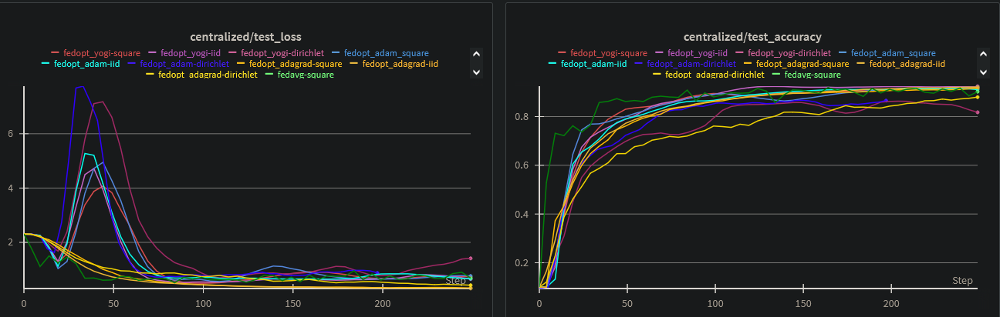

# Federated Learning with Flower and PyTorch

This repository implements a flexible and extensible federated learning pipeline using [Flower](https://flower.dev/) and
PyTorch. It supports multiple aggregation strategies, data partitioning methods, and is designed to simulate realistic
edge-device scenarios.

<p>
  
</p>

## ✨ Features

- CIFAR-10 image classification using a VGG-11 CNN (can be replaced with any PyTorch model and dataset)
- Federated learning with configurable aggregation strategies:
    - **FedAvg**
    - **FedOpt** (with Adam, Yogi, or AdaGrad)
    - **Weighted FedAvg**
- Multiple partitioning strategies to simulate heterogeneity
- Full and partial client participation
- Integrated experiment logging via Weights & Biases (`wandb`)
- Easily configurable via `pyproject.toml`

## ⚙️ Installation

For detailed installation instructions, please refer to
the [Flower installation guide](https://flower.ai/docs/framework/how-to-install-flower.html).

## 🛠️ Configuration

All parameters can be configured in `pyproject.toml` under `[tool.flwr.app.config]`.

```toml
# Dataset and partitioning
dataset = "uoft-cs/cifar10"
partitioning-strategy = "iid" # Options: iid, dirichlet, pathological, shard, size, linear, square, exponential
seed = 35

# Logging
logger-type = "wandb"
run-name = "fedavg-weighted-iid"

# Server settings
num-server-rounds = 10
fraction-fit = 1.0
server_learning-rate = 0.01
strategy-name = "fedavg-weighted"
strat_optimizer = "adagrad"

# Client settings
local-epochs = 10
batch-size = 256
client-learning-rate = 0.001
client-optimizer = "adam"
early-stopping = true
```

## 📊 Supported Partitioning Strategies

| Strategy         | Description                                                                  |
|------------------|------------------------------------------------------------------------------|
| **iid**          | Uniform distribution across clients                                          |
| **dirichlet**    | Class distribution controlled by Dirichlet concentration (`dirichlet-alpha`) |
| **pathological** | Each client receives samples from a fixed number of classes                  |
| **shard**        | Clients get shards of class-sorted data                                      |
| **size**         | Clients receive custom-sized data partitions                                 |
| **linear**       | Partition size linearly proportional to client index                         |
| **square**       | Quadratic relationship to client index                                       |
| **exponential**  | Exponential partition size growth                                            |

## ➕ Adding a New Partitioning Strategy

1. Implement your logic in `fed/partitioning/partitioning.py`
2. Add configuration support to `pyproject.toml`
3. Update the partition manager in your simulation script if needed

## 🔄 Aggregation Strategies

- **FedAvg**: Standard federated averaging.
- **FedOpt**: Adaptive optimizers at the server side (Adam, Yogi, AdaGrad).
- **Weighted FedAvg**: Considers both local dataset size and number of epochs for weighting.

## 🧪 Experiments Overview

### Experiment 1: Equal Client Capabilities

- **Setup**: 5 clients, 50 rounds, partial participation (`fraction_fit = 0.3`)
- **Findings**:
    - All strategies converge under IID
    - **FedOpt (Adam)** performs best on Square partition
    - **FedOpt (AdaGrad)** performs best on Dirichlet partition

### Experiment 2: Full Participation with Variable Epochs

- **Setup**: All clients participate every round; train for different number of epochs (∼5, 10, 15)
- **Findings**:
    - **FedOpt (Adam)** suffers from instability
    - **Weighted FedAvg** performs robustly across IID, Dirichlet, and Pathological partitions

See the [Technical Report](./report/Federated%20Learning%20Technical%20Report%20Revised.pdf) for full experimental
results and discussion.

## 👥 Collaborators

- David Szilagyi – [@davszi](https://github.com/davszi)
- Răzvan-Gabriel Petec – [@razvan404](https://github.com/razvan404)

## 📄 License

This project is licensed under the **Apache 2.0 License**. See the [LICENSE](./LICENSE) file for details.

## 📚 References

- [Flower](https://flower.dev/)
- [FedAvg](https://arxiv.org/abs/1602.05629)
- [Adaptive Federated Optimization (FedOpt)](https://arxiv.org/abs/2003.00295)
- [VGG](https://arxiv.org/abs/1409.1556)